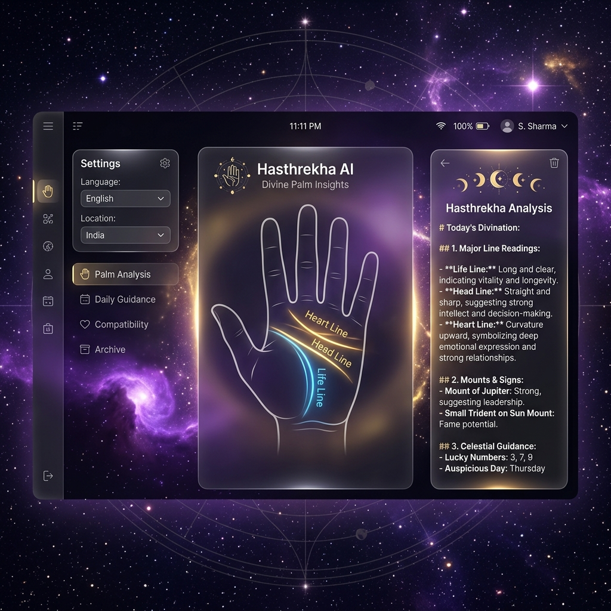
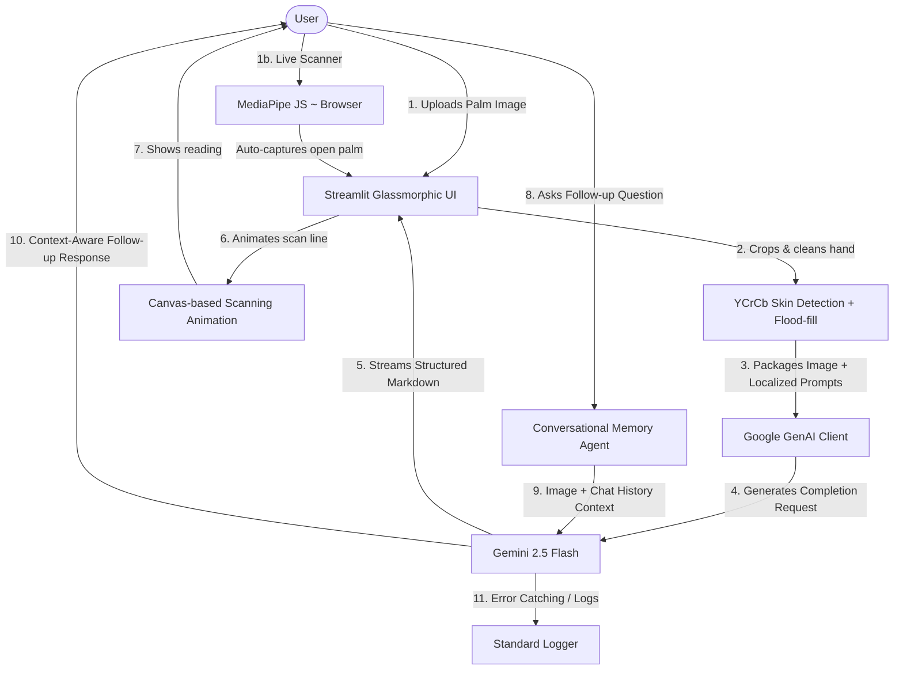

# 🔮 Hasthrekha — AI-Powered Multilingual Palmistry

[](https://palm-reader-app-nftd8sq4skxhr72dznprgd.streamlit.app/)
[](https://www.python.org/)
[](https://ai.google.dev/)
[](https://opensource.org/licenses/MIT)

**Hasthrekha** (हस्तरेखा) is a production-ready, highly stylized AI palmistry application designed to demonstrate the integration of multimodal Large Language Models (LLMs) with fluid, stateful web interfaces. Combining the traditional principles of Vedic, Western, and Chinese palmistry with modern vision-language models and stateful chat systems, it generates comprehensive, contextual character and guidance readings.

🔗 **Try the Live Application:** [https://palm-reader-app-nftd8sq4skxhr72dznprgd.streamlit.app/](https://palm-reader-app-nftd8sq4skxhr72dznprgd.streamlit.app/)

<p align="center">
  
</p>

---

## 🏗️ System Architecture & AI Engineering

This application functions as a showcase for production-grade LLM orchestration patterns, combining vision capabilities, stateful caching, and bilingual dynamic prompt generation.



### 🧠 Core Architectural Modules

#### 1. Multimodal Vision Pipeline
Rather than relying on classic Computer Vision (CV) contour-detection models—which are highly sensitive to shadows, contrast variation, and skin tone—Hasthrekha leverages the native multimodal visual parsing of **Gemini 2.5 Flash**. The model evaluates hand shape, mount prominence, and major palm lines directly from the raw image tensor using highly targeted structural coordinates.

#### 2. Bilingual Translation Routing Engine
The application natively handles **Hindi** and **English** (defaulting to English). Selecting a language instantly triggers two transformations:
* **UI Translation:** Translates selectbox options, form tags, camera headers, instruction guides, tooltips, and copywriting maps.
* **Instruction Injection:** Dynamically updates the model system prompts (`get_system_prompt` and `get_followup_system_prompt`) to enforce strict output language targets, requesting responses in Devanagari script for Hindi while retaining standard technical English terms (e.g., *Heart Line*, *Jupiter Mount*) for clarity.

#### 3. Conversational State Machine
Follow-up questions are routed through a memory state machine that maintains conversational context. Instead of legacy string-concatenation prefixes (e.g. `USER:` or `MODEL:`), the agent maps chat history directly to native **`genai.types.Content` and `genai.types.Part` structured schemas**, passing roles explicitly (`"user"` or `"model"`). The payload contains the original palm image tensor, the initial reading context, and a rolling structured history of conversation turns.

#### 4. Real-time Token Streaming
To maximize user experience and minimize perceived latency, the application implements real-time visual streaming. Readings and follow-up answers are streamed token-by-token directly from `client.models.generate_content_stream` to the Streamlit frontend using native generators (`yield`), providing immediate responsive feedback.

#### 5. Cached Resource Architecture
We leverage Streamlit's resource-caching system (`st.cache_resource`) to instantiate the Google GenAI client object. Rather than rebuilding the client thread and setup configuration on every script run (which Streamlit executes on every click or input change), connection pools are maintained globally, eliminating initialization handshaking overhead.

#### 6. Live Hand Scanner with Auto-Capture
The Live Scanner tab runs **MediaPipe Hand Landmarker** entirely client-side via a `<script type="module">` import from CDN (`@mediapipe/tasks-vision@0.10.3`). The WASM inference runs on GPU in the browser. When an open palm (≥3 fingers extended) is detected steadily for ~20 frames, a frame is auto-captured from the webcam, displayed below the live feed, and sent back to Streamlit via `postMessage`. A green glow bounding box is drawn around each detected hand for visual feedback.

#### 7. AI-Free Hand Cropping Pipeline
Before sending to Gemini, the image is preprocessed entirely with **PIL + numpy** (zero native deps). The pipeline: YCrCb skin segmentation → flood-fill from image center → bounding-box crop → blurred mask compositing onto dark background. This avoids OpenCV/MediaPipe Python dependency issues on Streamlit Cloud.

#### 8. Two-Phase Image Upload
Images are delivered to Gemini via a fallback chain: **GenAI File API** (`client.files.upload` with JPEG) first, then **`Part.from_bytes`** if the File API is unavailable. This ensures compatibility across different API key scopes and regions.

#### 9. Scanning Animation Overlay
After cropping, a `components.html`-embedded canvas animates a glowing purple scanner line that sweeps top-to-bottom over the palm image, complete with mount labels and particle effects—creating the illusion of an active palm scan before results appear.

#### 6. Structured Logging & Observability
The application uses Python's standard `logging` library. All major events—including GenAI client construction, image upload metrics, reading category triggers, follow-up submissions, and exceptions—are logged to standard output, making the app highly observable in production environments.

---

## ⚙️ Production Hardening & Security Best Practices

To transition the proof-of-concept into a production-hardened app, several security and layout rules are implemented:

* **CSRF & CORS Hardening:** Active Cross-Origin Resource Sharing (CORS) check and Cross-Site Request Forgery (XSRF) protections are explicitly enabled in `.streamlit/config.toml` to block cross-site execution vectors.
* **Hiding Developer Error Details:** Set `showErrorDetails = false` to suppress raw Python stack tracebacks on user screens. Instead, the UI displays a clean warning box.
* **Whitespace Sanitization:** Ingestion of user-supplied API keys uses strict `.strip()` trimming, avoiding auth failures from copy-pasting whitespace characters.
* **Generator-Level Failure Resilience:** Stream generators catch API execution timeouts and rate blocks at the source, streaming formatted error indicators to the client layout rather than breaking execution.
* **Safe Image Deserialization:** Image uploads are filtered through a try-except structure, protecting against crash exploits or decompression bombs.
* **State Resets on Input Swaps:** The reading state is tied to image identifiers (hashing name and size) and language toggles. Uploading a different file or switching language immediately resets old readings and chat contexts to prevent visual/textual mismatch.
* **Upgraded Sizing APIs:** Swapped out deprecated sizing calls (`use_container_width=True`) for modern Streamlit `width="stretch"` arguments, assuring compatibility with post-2025 Streamlit version engines (Streamlit 1.50+).

---

## 🛠️ Prompt Engineering & Model Configurations

To ensure deterministic, high-quality, and structurally consistent outputs, the application configures Gemini with precise hyperparameter settings:

| Parameter | Configuration Value | Rationale |
|:---|:---|:---|
| **Model** | `gemini-2.5-flash` | Selected for optimal balance of vision accuracy, fast token throughput, and low cost. |
| **Temperature** | `0.8` | Selected to foster rich, empathetic, and nuanced character analyses without drifting into hallucinations. |
| **Max Output Tokens** | `4096` | Set high to allow for deep, comprehensive multi-section complete readings. |
| **System Instruction** | Context-Locked Roleplay | Pins the assistant identity to an expert palm reader, enforcing safety disclaimers and styling formatting. |

---

## 🔒 Responsible AI & Safety Guardrails

1. **Ephemeral Processing:** Uploaded images are held transiently in standard memory and are never persisted to a storage bucket, database, or disk.
2. **Health & Financial Guardrails:** System prompts contain strict negative constraints forbidding the model from making medical diagnoses, predicting lifespans, or giving concrete financial investment numbers.
3. **Refusal Capabilities:** Prompts instruct the model to politely refuse questions about items not visible in the uploaded frame, ensuring integrity.
4. **Image Validation Guardrail:** The model enforces pre-analysis verification, immediately refusing processing if the uploaded photo does not contain a visible human hand or open palm (e.g., random objects, animals, document scans, landscape), requesting a proper palm photo instead.
5. **Chat Domain-Lock Guardrail:** The conversational follow-up assistant is domain-locked. If users submit questions unrelated to palmistry, their reading, or hand guidance (e.g., requesting code templates, general knowledge questions, math queries, or general chatting), the assistant will politely refuse and redirect them back to the palm reading context.

---

## 🚀 Local Installation

### Prerequisites
* Python 3.9+ installed.
* A Google Gemini API Key (Generate one for free at [Google AI Studio](https://aistudio.google.com/apikey)).

### Installation Steps

1. **Clone the repository:**
   ```bash
   git clone https://github.com/<your-username>/palm-reader-app.git
   cd palm-reader-app
   ```

2. **Create a Virtual Environment:**
   ```bash
   python3 -m venv venv
   source venv/bin/activate  # On Windows: venv\Scripts\activate
   ```

3. **Install Requirements:**
   ```bash
   pip install -r requirements.txt
   ```

4. **Add Configuration:**
   Create a `.env` file in the root directory:
   ```env
   GEMINI_API_KEY=your_actual_api_key_here
   ```

5. **Run the Server:**
   ```bash
   streamlit run app.py
   ```
   Open your local browser to `http://localhost:8501`.
