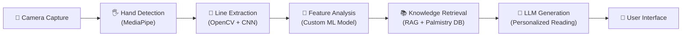

# 📊 Market Research — AI Palmistry App Landscape

---

## 1. Market Overview

### 1.1 Market Size & Growth

The astrology and spiritual wellness app market is experiencing explosive growth, driven by increasing consumer interest in personal well-being, AI-powered personalization, and the mainstreaming of spiritual practices among younger demographics.

| Metric | Value | Source |
|:---|:---|:---|
| Global Market Size (2025) | ~$4.7 Billion | Research and Markets, Business Research Company |
| Projected Size (2030) | $9B+ | Business Research Insights |
| Projected Size (2035) | Up to $46.6B | MarkNtel Advisors |
| CAGR | 14% – 25% | Multiple analyst firms |
| Mobile App Revenue Share | 60%+ of total industry | DevTechnoSys |
| Subscription Revenue Share | 40–45% of total | Market Mind Partners |
| Cumulative Downloads (2024) | 180M+ | Market Growth Reports |

### 1.2 Market Segmentation

```
Spiritual Wellness Apps
├── Astrology / Horoscope (Largest segment — ~45%)
├── Tarot Reading (~20%)
├── Palmistry (~12% — fastest growing sub-segment)
├── Numerology (~10%)
├── Meditation & Mindfulness (~8%)
└── Other (Vastu, Feng Shui, etc. — ~5%)
```

> [!IMPORTANT]
> **Palmistry is the fastest-growing sub-segment** because it uniquely enables AI + camera interaction, making it inherently more engaging and "shareable" than text-based horoscope apps.

---

## 2. Competitive Landscape

### 2.1 Direct Competitors

| App | Platform | Key Strengths | Key Weaknesses | Rating | Est. Downloads |
|:---|:---|:---|:---|:---|:---|
| **Palmist** | iOS/Android | High-end "Hand Code" tech, large pattern database | No AI chat, limited traditions, expensive premium | 4.5★ | 5M+ |
| **Creen (AI Palm Reader)** | iOS/Android | Multi-tradition (Western, Chinese, Hindu), granular line analysis | UI feels dated, no live experts, limited social features | 4.3★ | 2M+ |
| **Palmistry – AI Palm Reader** | iOS/Android | Daily guidance, love/career focus, interactive chat | Generic readings, limited CV accuracy, heavy ads | 4.1★ | 3M+ |
| **Palm Reader AI (Pandit Divya)** | iOS/Android | 12+ languages, chat-first UX | Lower accuracy, minimal gamification | 4.0★ | 1M+ |
| **Purple Garden** | iOS/Android | Live human palm readers, hybrid AI+human | Very expensive per session, not AI-first | 4.6★ | 10M+ |

### 2.2 Indirect Competitors

| App | Category | Overlap |
|:---|:---|:---|
| **Co–Star** | Astrology | Daily personalized insights, strong social features, Gen Z favorite |
| **The Pattern** | Astrology/Personality | AI-driven personality analysis, relationship compatibility |
| **Sanctuary** | Astrology | Live astrologer chat, premium positioning |
| **Nebula** | Astrology/Tarot | Multi-modality (horoscope + tarot + numerology) |
| **Headspace / Calm** | Wellness | Competing for the same "daily self-care ritual" habit slot |

### 2.3 Competitive Gap Analysis

```mermaid
quadrant-chart
    title Competitive Positioning
    x-axis Low AI Sophistication --> High AI Sophistication
    y-axis Low Engagement --> High Engagement
    quadrant-1 "Leaders"
    quadrant-2 "Niche Players"
    quadrant-3 "Laggards"
    quadrant-4 "Tech-Heavy"
    "PalmVerse (Target)": [0.9, 0.9]
    "Palmist": [0.7, 0.5]
    "Creen": [0.6, 0.4]
    "Purple Garden": [0.3, 0.7]
    "Palm Reader AI": [0.4, 0.3]
    "Co-Star": [0.5, 0.85]
```

> [!TIP]
> **The white space is in the upper-right quadrant** — high AI sophistication combined with high engagement. No current palmistry app occupies this space. PalmVerse should aim here.

---

## 3. Target Audience

### 3.1 Primary Personas

#### Persona 1: "Curious Zara" (Gen Z Explorer)
- **Age:** 18–26
- **Behavior:** Active on TikTok/Instagram, uses astrology for self-identity, shares readings with friends
- **Motivation:** Self-discovery, social currency, entertainment
- **Willingness to Pay:** Low (needs strong free tier), converts via social proof
- **Daily App Time:** 15–30 min across wellness apps

#### Persona 2: "Mindful Maya" (Millennial Seeker)
- **Age:** 27–38
- **Behavior:** Uses wellness apps daily, meditates, reads self-help books
- **Motivation:** Personal growth, decision-making support, stress management
- **Willingness to Pay:** Medium-High (subscribes to 2–3 wellness apps)
- **Daily App Time:** 20–45 min

#### Persona 3: "Traditional Raj" (Cultural Practitioner)
- **Age:** 30–55
- **Behavior:** Follows Vedic astrology, consults pandits, believes in palmistry tradition
- **Motivation:** Authentic spiritual guidance, kundli/palm matching
- **Willingness to Pay:** High for authentic, expert-driven content
- **Daily App Time:** 10–20 min

### 3.2 Geographic Focus

| Region | Priority | Rationale |
|:---|:---|:---|
| **India** | 🔴 Primary | Largest cultural affinity for palmistry, massive smartphone adoption, Hindi/regional language demand |
| **United States** | 🔴 Primary | Highest ARPU, strong Gen Z astrology culture, TikTok "Astrotok" community |
| **Southeast Asia** | 🟡 Secondary | Strong spiritual traditions, growing smartphone market |
| **Europe (UK, Germany)** | 🟡 Secondary | Growing wellness app adoption, premium pricing tolerance |
| **Latin America** | 🟢 Tertiary | Emerging market, high mobile engagement |

---

## 4. Technology Landscape

### 4.1 Computer Vision for Palm Analysis

| Technology | Description | Maturity |
|:---|:---|:---|
| **MediaPipe Hands** | Google's real-time hand landmark detection (21 landmarks) | Production-ready |
| **OpenCV** | Image processing for edge detection, contour analysis | Mature |
| **CNNs (Custom)** | Trained on palm datasets for line classification | Requires training data |
| **Vision Transformers (ViT)** | Latest architecture for palmprint recognition, superior accuracy | Cutting-edge |
| **TensorFlow Lite / Core ML** | On-device inference for privacy and speed | Production-ready |

### 4.2 AI/ML Pipeline



### 4.3 Key Technical Considerations

| Concern | Approach |
|:---|:---|
| **Accuracy** | 80–90% line detection under good lighting; guide user with real-time camera overlay |
| **Privacy** | Process images on-device where possible; never store raw hand images permanently |
| **Latency** | Target < 3 seconds from capture to reading on modern smartphones |
| **Offline Mode** | Cache basic model on-device for instant scans; detailed readings require connection |
| **Bias** | Train on diverse hand datasets (skin tones, ages, hand sizes) to avoid demographic bias |

---

## 5. Key Market Trends

### 5.1 Trends Favoring PalmVerse

1. **"Spiritual but not religious" (SBNR) movement** — Growing demographic that uses astrology/palmistry as secular self-reflection tools
2. **AI personalization expectation** — Users expect every app to "know them"; generic fortune-cookie readings cause immediate churn
3. **Camera-first interactions** — TikTok/Snapchat generation is comfortable with camera-based app experiences
4. **Hybrid AI + Human** — Users trust AI for convenience but want human experts for "big life questions"
5. **Wellness bundling** — Apps that combine multiple modalities (palm + astrology + tarot) see 2–3x higher retention

### 5.2 Risks & Threats

| Risk | Severity | Mitigation |
|:---|:---|:---|
| **Regulatory scrutiny** on health/wellness claims | 🟡 Medium | Clear "entertainment purposes" disclaimers; never make medical/financial claims |
| **Privacy concerns** with biometric (hand) data | 🔴 High | On-device processing, GDPR/CCPA compliance, transparent data policy |
| **Market saturation** from copycat apps | 🟡 Medium | Deep moat via proprietary CV model + RAG knowledge base + community |
| **AI backlash / skepticism** | 🟢 Low | Blend AI with human expert consultations; emphasize tradition grounding |
| **Platform policy changes** (Apple/Google) | 🟡 Medium | Diversify to web app; maintain compliance with store guidelines |

---

## 6. Key Takeaways

> [!NOTE]
> ### The Winning Formula
> 1. **Best-in-class CV scanning** that feels magical on first use
> 2. **Multi-tradition knowledge** (not just generic text) grounded in real palmistry
> 3. **Conversational AI** that remembers context and allows follow-up questions
> 4. **Social + community features** that drive viral growth
> 5. **Privacy-first architecture** as a trust differentiator
> 6. **India + US dual launch** to capture both the largest cultural market and highest ARPU market
