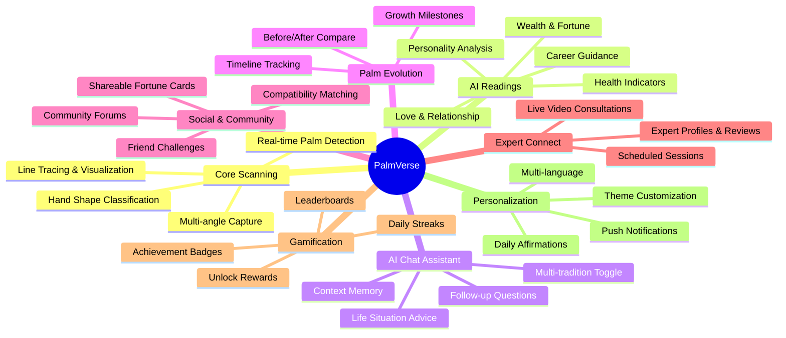
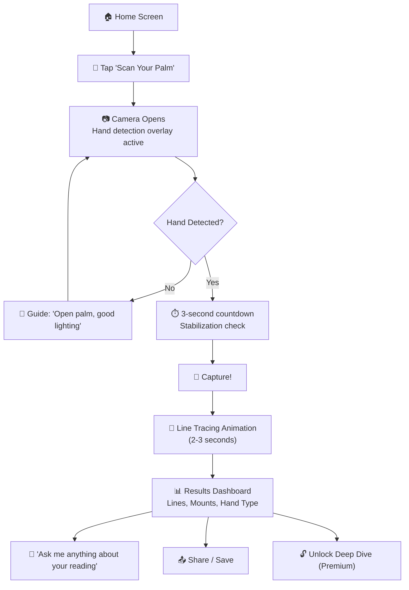

# 🖐️ Product Features & Vision — PalmVerse

---

## Product Philosophy

> **"Ancient wisdom, modern intelligence."**

PalmVerse isn't a fortune-telling gimmick — it's a **personal growth companion** powered by AI that uses the rich tradition of palmistry as a lens for self-reflection, decision-making, and daily guidance.

**Three Pillars:**
1. **🔬 Science** — Computer vision and ML for accurate, reproducible palm analysis
2. **📜 Tradition** — Grounded in Vedic, Western, and Chinese palmistry knowledge bases
3. **💬 Conversation** — AI that talks with you, not at you

---

## Feature Map Overview



---

## Detailed Feature Breakdown

### 🔮 Module 1: AI Palm Scanner (Core)

The heart of the app — the camera-powered palm scanning experience.

#### Features

| Feature | Description | Priority |
|:---|:---|:---|
| **Real-time Hand Detection** | Camera overlay with live hand landmark detection using MediaPipe; guides user to position hand correctly | P0 |
| **Guided Capture Flow** | Step-by-step instructions: "Open your palm," "Hold steady," "Good lighting detected" with visual/haptic feedback | P0 |
| **Line Tracing Visualization** | After capture, animate the detection of Heart, Head, Life, Fate, and Sun lines directly on the palm image | P0 |
| **Mount Analysis** | Identify and label the 7 mounts (Jupiter, Saturn, Apollo, Mercury, Venus, Moon, Mars) | P0 |
| **Hand Shape Classification** | Classify hand as Earth, Air, Fire, or Water type based on palm and finger proportions | P1 |
| **Finger Length Ratios** | Analyze finger length proportions for additional personality insights | P1 |
| **Multi-angle Scanning** | Optional secondary captures (side view, finger close-ups) for premium deep-dive reports | P2 |
| **AR Overlay Mode** | Live AR visualization showing line names and meanings in real-time before capture | P2 |

#### User Flow



---

### 💬 Module 2: AI Chat Assistant ("PalmGuide")

A conversational AI that transforms static readings into dynamic, personalized guidance.

#### Features

| Feature | Description | Priority |
|:---|:---|:---|
| **Contextual Chat** | LLM-powered chat that has full context of the user's palm reading results | P0 |
| **Follow-up Questions** | User can ask "What does my broken heart line mean for my current relationship?" | P0 |
| **Multi-tradition Toggle** | Switch between Vedic, Western, and Chinese interpretations within the same chat | P1 |
| **Life Situation Context** | User provides current life context (career change, new relationship) for tailored advice | P1 |
| **Reading History Context** | AI remembers past readings and can compare/reference them in conversation | P1 |
| **Voice Chat Mode** | Speak your questions; AI responds with text + optional voice synthesis | P2 |
| **Daily Check-in Chat** | Short daily conversation: "How are you feeling today?" → contextual palm-based guidance | P2 |

#### Chat Experience Example

```
🤖 PalmGuide: Based on your scan, your Heart Line shows a strong 
   upward curve toward Jupiter mount. This traditionally indicates 
   deep emotional expressiveness and a tendency toward passionate, 
   idealistic relationships.

👤 User: I've been having issues with my partner lately. 
   What does my palm say about that?

🤖 PalmGuide: I notice your Heart Line has a small fork near 
   Saturn mount — in Vedic palmistry, this can indicate a period 
   of emotional growth through challenge. Combined with your 
   strong Fate Line, this suggests the difficulty you're experiencing 
   may lead to important personal clarity. Would you like me to 
   explore this through Western or Chinese tradition for 
   additional perspective?

👤 User: Yes, show me the Chinese interpretation.

🤖 PalmGuide: In Chinese palmistry (手相), your Heart Line pattern 
   is called "双叉线" (Double Fork Line). It's actually considered 
   auspicious — it suggests someone with the emotional intelligence 
   to navigate complex relationships and emerge stronger...
```

---

### 📈 Module 3: Palm Evolution Tracker

Track how your palm lines change over time — a unique feature no competitor offers.

#### Features

| Feature | Description | Priority |
|:---|:---|:---|
| **Scan Timeline** | Visual timeline of all past scans with thumbnails | P1 |
| **Before/After Overlay** | Superimpose two scans to visualize changes in lines over months/years | P1 |
| **Change Detection AI** | AI highlights what changed and interprets meaning of the evolution | P2 |
| **Growth Milestones** | Celebrate personal growth moments: "Your Fate Line has deepened — you're becoming more decisive!" | P2 |
| **Annual Palm Report** | Yearly comprehensive report comparing beginning-of-year vs. end-of-year palm state | P2 |

---

### 📊 Module 4: Reading Categories

Deep-dive reports across life domains, each unlockable individually or via subscription.

| Category | What It Covers | Free | Premium |
|:---|:---|:---|:---|
| **🧠 Personality & Temperament** | Hand type, finger ratios, dominant mount, emotional vs. logical tendencies | Basic summary | Full 2000-word report |
| **💼 Career & Purpose** | Fate Line depth, Sun Line presence, Jupiter mount strength | Top-line insight | Detailed career path analysis |
| **❤️ Love & Relationships** | Heart Line analysis, Venus mount, relationship compatibility patterns | Single-line summary | Full compatibility framework |
| **💪 Health Indicators** | Health Line patterns, Life Line vitality markers | General wellness note | Detailed health awareness guide |
| **💰 Wealth & Fortune** | Money lines, Sun Line, Mercury mount analysis | Lucky indicators | Full financial tendency report |
| **🌟 Life Path & Destiny** | Fate Line + Life Line + Head Line composite analysis | Overview | Complete destiny narrative |
| **🤝 Compatibility (with partner)** | Two-palm comparative analysis | Not available | Full report |

---

### 🏆 Module 5: Gamification & Engagement

Transform palm reading from a one-time novelty into a daily habit.

#### Features

| Feature | Description | Priority |
|:---|:---|:---|
| **Daily Affirmation** | Personalized affirmation based on hand type and current planetary alignment | P0 |
| **Reading Streak** | Track consecutive days of engagement; unlock rewards at 7, 30, 90, 365 days | P1 |
| **Achievement Badges** | Earn badges: "First Scan," "Palm Scholar" (read 10 reports), "Social Butterfly" (shared 5 readings) | P1 |
| **Daily Lucky Number/Color** | Quick daily insight based on palm-derived numerology | P1 |
| **Challenges** | Weekly challenges: "Scan your friend's palm," "Ask 3 follow-up questions" | P2 |
| **XP System** | Earn experience points for engagement; level up your "Palm Wisdom" tier | P2 |
| **Seasonal Events** | Special readings during equinoxes, New Year, eclipses, etc. | P2 |

#### Streak & Badge System

```
🔥 Daily Streak: 14 days
⭐ Level: Palm Adept (Level 7)
🏅 Badges Earned: 12/40

Recent Badges:
🥇 "First Scan" — Completed your first palm reading
🔮 "Tradition Explorer" — Viewed reading in all 3 traditions  
💬 "Curious Mind" — Asked 10 follow-up questions to PalmGuide
🤝 "Matchmaker" — Compared palms with a friend
📅 "Committed Seeker" — 7-day reading streak
```

---

### 🌐 Module 6: Social & Community

Make palmistry a shared experience that drives viral growth.

#### Features

| Feature | Description | Priority |
|:---|:---|:---|
| **Shareable Fortune Cards** | Beautiful, branded cards with key insights; optimized for Instagram Stories, WhatsApp, TikTok | P0 |
| **Compatibility Matching** | Compare palm readings with friends/partner; generate a "Compatibility Score" | P1 |
| **Community Forum** | Discussion space organized by topics: Career, Love, Spirituality, Beginner Q&A | P2 |
| **Invite & Earn** | Referral program: invite friends → earn premium credits | P1 |
| **Group Readings** | Party mode: scan multiple palms in a session for group fun | P2 |
| **Trending Insights** | "People with your hand type are trending toward [career/trait] this month" | P2 |

#### Shareable Fortune Card Example

```
┌────────────────────────────────────┐
│  ✨ PalmVerse Daily Insight ✨      │
│                                    │
│  🖐️ Your Hand Type: Fire 🔥       │
│                                    │
│  "Your strong Heart Line suggests  │
│   today is perfect for expressing  │
│   what you've been holding back."  │
│                                    │
│  Lucky Number: 7                   │
│  Lucky Color: Amber 🟠            │
│                                    │
│  📱 Scan yours at palmverse.app    │
└────────────────────────────────────┘
```

---

### 👨‍🏫 Module 7: Expert Connect

Bridge AI with human wisdom for users who want deeper, personalized guidance.

#### Features

| Feature | Description | Priority |
|:---|:---|:---|
| **Expert Directory** | Browse verified palmists/astrologers with profiles, specialties, ratings, and languages | P1 |
| **Video Consultation** | 15/30/60-minute live video sessions with experts | P2 |
| **Chat Consultation** | Async text-based consultation with 24-hour response guarantee | P2 |
| **AI Pre-brief** | Before the session, the AI shares the user's scan results with the expert for context | P2 |
| **Expert Verification** | Background check + skill verification for all listed experts | P1 |
| **Rating & Review** | Post-session rating system to maintain quality | P2 |

---

### ⚙️ Module 8: Settings & Personalization

| Feature | Description | Priority |
|:---|:---|:---|
| **Multi-language Support** | Launch: English, Hindi, Spanish. Phase 2: Tamil, Telugu, Mandarin, Portuguese, German, French, Japanese, Korean, Arabic | P0 |
| **Dark/Light/Mystical Themes** | Multiple UI themes including a premium "Celestial" dark theme | P1 |
| **Notification Preferences** | Granular control: daily affirmation, weekly report, streak reminders, planetary events | P1 |
| **Privacy Dashboard** | View/delete all stored data, manage scan history, export data | P0 |
| **Preferred Tradition** | Set default palmistry tradition (Vedic/Western/Chinese) with ability to switch per reading | P1 |

---

## Phased Roadmap

### Phase 1: MVP (Month 1–3) — "The Magic First Scan"

> Goal: Nail the core scanning experience and first-time "wow" moment

- [x] AI Palm Scanner with guided capture flow
- [x] Line tracing visualization (Heart, Head, Life, Fate, Sun)
- [x] Basic personality reading (500 words)
- [x] Hand type classification
- [x] Daily affirmation
- [x] Shareable fortune cards
- [x] English + Hindi language support
- [x] Privacy-first architecture (on-device processing)
- [x] Basic paywall (free scan + premium reports)

### Phase 2: Engagement (Month 4–6) — "Make It a Habit"

- [ ] AI Chat Assistant (PalmGuide) with follow-up questions
- [ ] Multi-tradition toggle (Vedic/Western/Chinese)
- [ ] Streak & badge system
- [ ] Compatibility matching
- [ ] Push notification engine (behavioral triggers)
- [ ] Palm Evolution Tracker (timeline)
- [ ] 3 additional languages
- [ ] Referral program

### Phase 3: Monetization (Month 7–9) — "Unlock Revenue"

- [ ] Deep-dive premium reports (Career, Love, Health, Wealth)
- [ ] Expert Connect (directory + chat consultations)
- [ ] Subscription tiers (monthly/annual)
- [ ] Rewarded video ads for free users
- [ ] Dynamic paywall (ML-driven trigger optimization)
- [ ] Annual Palm Report

### Phase 4: Scale (Month 10–12) — "Build the Community"

- [ ] Community forums
- [ ] Video consultations with experts
- [ ] Group reading mode
- [ ] AR overlay mode
- [ ] Voice chat with PalmGuide
- [ ] Seasonal events engine
- [ ] 12+ total languages
- [ ] Web app companion

---

## Success Metrics

| Metric | Phase 1 Target | Phase 4 Target |
|:---|:---|:---|
| **D1 Retention** | 40% | 55% |
| **D7 Retention** | 20% | 35% |
| **D30 Retention** | 8% | 20% |
| **Avg. Session Duration** | 3 min | 8 min |
| **Scans per User (monthly)** | 2 | 12 |
| **Free → Premium Conversion** | 3% | 8% |
| **App Store Rating** | 4.2★ | 4.7★ |
| **NPS Score** | 30 | 60 |
