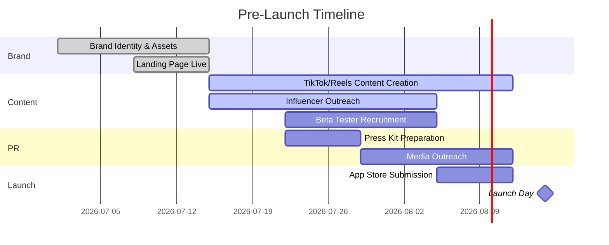
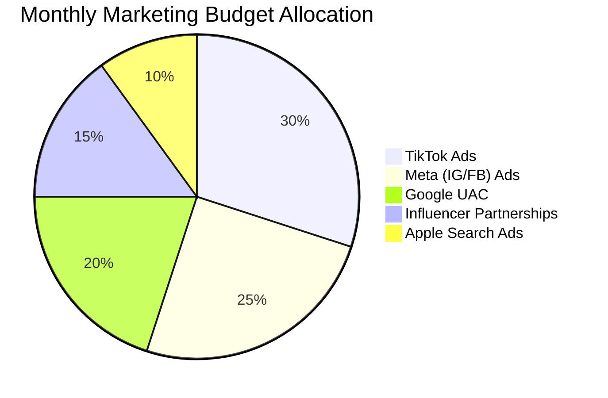
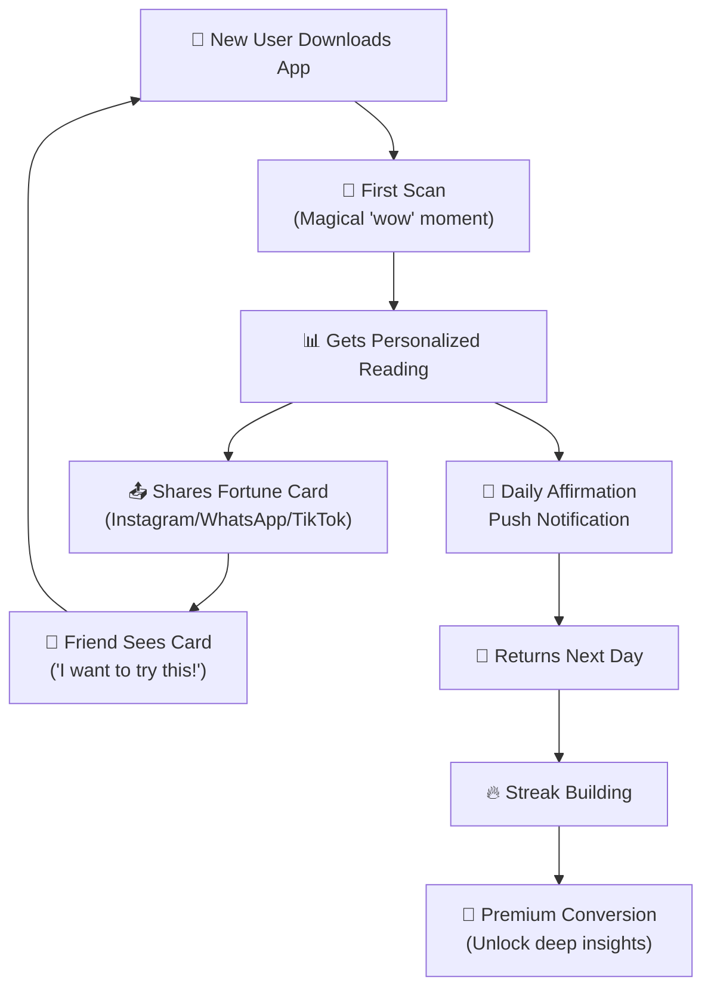

# 🚀 Go-To-Market (GTM) Plan — PalmVerse

---

## GTM Philosophy

> **"Position as wellness, market as entertainment, retain as habit."**

PalmVerse enters the market not as a "fortune-telling app" but as an **AI-powered self-discovery companion**. Our GTM strategy leverages the inherently viral nature of palm readings (camera interaction → shareable results → friend curiosity → organic download) combined with targeted influencer campaigns and aggressive ASO.

---

## 1. Positioning & Brand Identity

### 1.1 Brand Positioning Statement

> *For millennials and Gen Z who are curious about self-discovery, PalmVerse is the AI-powered palmistry companion that transforms your palm into a personalized map of your personality, relationships, and life path — powered by computer vision, grounded in ancient wisdom, and made for the modern seeker.*

### 1.2 Brand Personality

| Attribute | Expression |
|:---|:---|
| **Tone** | Mystical yet modern; wise but not preachy |
| **Visual** | Dark celestial theme, gold accents, fluid animations |
| **Voice** | Warm, insightful, gently confident — like a trusted advisor |
| **Vibe** | Premium but accessible; like a wellness studio in your pocket |

### 1.3 Key Messaging Pillars

| Pillar | Message | Target |
|:---|:---|:---|
| **Self-Discovery** | "Your palm holds secrets about who you are — let AI reveal them" | Gen Z |
| **Ancient + AI** | "3,000 years of palmistry wisdom meets cutting-edge AI" | All segments |
| **Daily Companion** | "Your daily dose of guidance, personalized to your palm" | Retention-focused |
| **Social Fun** | "Compare palms with your bestie — who's more compatible?" | Viral growth |
| **Privacy-First** | "Your palm, your data. We never store your images" | Trust-building |

### 1.4 Category & Keywords

**Primary Category:** Lifestyle / Entertainment  
**Secondary Category:** Health & Fitness (where stores allow dual-listing)

**Target Keywords:**
- Palm reading, palmistry, palm reader, hand reading
- AI palm reader, palm scan, palm analysis
- Personality test, self-discovery app
- Daily horoscope, spiritual wellness, fortune telling
- Hand reading astrology, chiromancy

---

## 2. Launch Strategy — Three Phases

### Phase 1: Pre-Launch (Weeks -6 to 0) — "Build Anticipation"

#### Key Actions

| Action | Details | Timeline |
|:---|:---|:---|
| **Landing Page** | Mystical, animated landing page with waitlist signup; offer "Founder" badge for early signups | Week -6 |
| **Social Accounts** | Launch Instagram, TikTok, YouTube Shorts with teaser content | Week -6 |
| **Teaser Content** | 3x/week short-form videos: palm facts, "did you know" hooks, behind-the-scenes AI demos | Week -5 to -1 |
| **Influencer Seeding** | Send beta access to 50 micro-influencers (10K–100K followers) in astrology/wellness niche | Week -4 |
| **Beta Program** | 500-person closed beta via TestFlight/Play Store; collect feedback and testimonials | Week -3 |
| **Press Kit** | Professional media kit with screenshots, founder story, technology explainer, and brand assets | Week -2 |
| **Waitlist Goal** | Target 10,000 waitlist signups before launch day | Week -1 |

---

### Phase 2: Launch Week (Days 0–7) — "Create a Moment"

#### Day 0: Coordinated Launch Blitz

| Time | Action |
|:---|:---|
| **6:00 AM** | App goes live on App Store + Google Play |
| **8:00 AM** | Waitlist email blast: "PalmVerse is LIVE — your Founder badge is waiting" |
| **9:00 AM** | Influencer posts go live (coordinated across 20+ creators) |
| **12:00 PM** | TikTok LIVE: Professional palmist does live readings using PalmVerse |
| **3:00 PM** | Instagram Stories: "Scan your palm and share your reading" challenge |
| **6:00 PM** | Reddit posts in r/astrology, r/palmistry, r/spirituality (organic, value-driven) |
| **9:00 PM** | YouTube video: "We built an AI that reads your palm — here's how" (tech storytelling) |

#### Launch Week Campaigns

| Campaign | Platform | Mechanic |
|:---|:---|:---|
| **#ScanYourPalm Challenge** | TikTok, Instagram | Users scan their palm, react to results, tag friends. Influencers kickstart with their own reactions |
| **"What does your palm say?" Duet** | TikTok | Influencer reads their palm → invites followers to duet with their own reading |
| **"Palm Compatibility" Series** | Instagram Reels | Couples/friends compare palms and react to compatibility scores |
| **Reddit AMA** | r/astrology, r/palmistry | Founder + palmistry expert AMA about the science behind AI palm reading |
| **Product Hunt Launch** | Product Hunt | Target #1 Product of the Day in "Tech" category |

---

### Phase 3: Post-Launch Growth (Month 1–6) — "Sustain & Scale"

#### Monthly Content Calendar Template

| Week | TikTok/Reels (4-5x/week) | Instagram (3x/week) | YouTube (1x/week) |
|:---|:---|:---|:---|
| **Week 1** | User reaction compilations | Carousel: "5 things your Life Line reveals" | Deep dive: "How AI reads your palm" |
| **Week 2** | "POV: Your palm says you're about to..." | Fortune Card templates for stories | Expert interview: Vedic palmist |
| **Week 3** | Compatibility challenges | User testimonials | "Science of Palmistry" explainer |
| **Week 4** | Trending audio + palm facts | Monthly reading highlights | Product update / new feature demo |

---

## 3. Channel Strategy

### 3.1 Organic Growth Channels

#### TikTok (Primary — 40% of effort)

> [!IMPORTANT]
> TikTok is the **#1 growth channel**. "Astrotok" has 35B+ views. Palmistry content is inherently visual, reaction-worthy, and shareable — perfect for the algorithm.

| Content Type | Frequency | Goal |
|:---|:---|:---|
| **Reaction Videos** | 3x/week | "OMG this is so accurate" moments drive curiosity |
| **Educational Hooks** | 2x/week | "98% of people don't know this about their Heart Line" |
| **Challenge Content** | 1x/week | #ScanYourPalm, #PalmCompatibility |
| **Trending Audio Remixes** | 2x/week | Palm facts/insights set to trending sounds |
| **Live Sessions** | 1x/week | Live palm reading sessions using PalmVerse |

#### Instagram (Secondary — 25% of effort)

| Content Type | Frequency | Goal |
|:---|:---|:---|
| **Reels** | 3x/week | Repurposed TikTok content optimized for IG |
| **Carousels** | 2x/week | "What your [line/mount/hand type] means" educational content |
| **Stories** | Daily | Polls, quizzes, user submissions, behind-the-scenes |
| **Shareable Templates** | 1x/week | "Share your Fortune Card to your story" templates |

#### YouTube Shorts + Long-form (15% of effort)

| Content Type | Frequency | Goal |
|:---|:---|:---|
| **Shorts** | 3x/week | Repurposed TikTok content |
| **Explainer Videos** | 1x/month | "The Science Behind AI Palm Reading" — builds authority |
| **Expert Interviews** | 1x/month | Conversations with traditional palmists — builds credibility |

#### SEO / Blog (10% of effort)

| Content | Goal |
|:---|:---|
| "Complete Guide to Palm Reading" | Rank for "palm reading" (100K+ monthly searches) |
| "What Does Your Life Line Mean?" | Rank for specific line queries |
| "Best Palm Reading Apps 2026" | Rank for comparison keywords |
| "AI Palm Reading: How It Works" | Rank for tech-curious audience |

#### App Store Optimization (10% of effort)

| Element | Strategy |
|:---|:---|
| **App Name** | "PalmVerse: AI Palm Reader" |
| **Subtitle** | "Scan Your Palm · Get AI Insights" |
| **Keywords** | palm reading, palmistry, hand reader, AI fortune, personality test, daily horoscope |
| **Screenshots** | 5 screens showing: scan flow, line visualization, reading result, AI chat, sharing card |
| **Preview Video** | 15-sec showing the magical scan → reading flow |
| **Rating Prompt** | Trigger after positive reading experience (not on first session) |

---

### 3.2 Paid Growth Channels

#### Budget Allocation (Monthly)

#### Channel Details

| Channel | Strategy | Target CPI | Monthly Budget % |
|:---|:---|:---|:---|
| **TikTok Spark Ads** | Boost top-performing organic content and influencer posts as ads | $0.80–$1.50 | 30% |
| **Meta (IG/FB)** | Interest targeting: astrology, palmistry, wellness, meditation, tarot | $1.00–$2.00 | 25% |
| **Google UAC** | App install campaigns targeting "palm reading app," "palmistry," "AI fortune" | $0.50–$1.20 | 20% |
| **Influencer** | Ongoing partnerships with 10–20 micro-influencers on retainer | N/A (CPA-based) | 15% |
| **Apple Search Ads** | Bid on branded + category keywords in App Store | $1.50–$3.00 | 10% |

---

## 4. Influencer Marketing Strategy

### 4.1 Influencer Tiers

| Tier | Follower Range | Quantity | Use Case | Compensation |
|:---|:---|:---|:---|:---|
| **Nano** | 1K–10K | 100+ | Authentic user-generated content, reviews | Free premium + affiliate commission |
| **Micro** | 10K–100K | 30–50 | Campaign-specific content, challenges | $200–$1000/post + affiliate |
| **Mid** | 100K–500K | 5–10 | Major campaign launches, series content | $2K–$10K/post |
| **Macro** | 500K–5M | 1–3 | Brand awareness, launch day anchor | $10K–$50K/campaign |

### 4.2 Influencer Niches to Target

| Niche | Why | Platform |
|:---|:---|:---|
| **Astrology/Tarot creators** | Direct audience overlap, high trust | TikTok, Instagram |
| **Wellness/Mindfulness** | Adjacent audience, "daily ritual" positioning | Instagram, YouTube |
| **Lifestyle/Beauty** | Mass appeal, trend-setting influence | TikTok, Instagram |
| **Tech reviewers** | "Cool AI app" angle, credibility | YouTube, Twitter/X |
| **Couple/Relationship creators** | Compatibility feature drives engagement | TikTok, Instagram |
| **Indian spiritual content creators** | Massive Vedic palmistry audience | YouTube, Instagram |

### 4.3 Affiliate Program

| Metric | Terms |
|:---|:---|
| **Commission** | 25% of first subscription payment |
| **Cookie Duration** | 30 days |
| **Tracking** | Unique referral link + promo code per influencer |
| **Payment** | Monthly payout via PayPal/bank transfer |
| **Bonus** | Top 5 affiliates each month get additional $500 bonus |

---

## 5. Retention & Growth Loops

### 5.1 Core Growth Loop

### 5.2 Viral Coefficient Targets

| Metric | Target |
|:---|:---|
| **K-factor (viral coefficient)** | 1.2 – 1.5 (each user brings 1.2–1.5 new users) |
| **Share Rate** | 30% of users share at least 1 Fortune Card in first week |
| **Invite Conversion** | 15% of shared card viewers download the app |
| **Compatibility Feature Usage** | 25% of users try compatibility matching in first month |

### 5.3 Retention Levers

| Lever | Mechanism | Target Impact |
|:---|:---|:---|
| **Daily Affirmation** | Push notification with personalized daily insight | +15% D7 retention |
| **Streak System** | Psychological investment in maintaining streak | +20% D30 retention |
| **Weekly Report** | "Your Palm Week in Review" email/notification | +10% re-engagement |
| **Social Triggers** | "Your friend just scanned their palm!" notification | +12% DAU |
| **Content Updates** | New reading categories, seasonal events every 2 weeks | -25% churn rate |

---

## 6. Launch Markets & Localization

### 6.1 Phase 1 Markets (Launch)

| Market | Language | Rationale | Priority |
|:---|:---|:---|:---|
| **India** | English + Hindi | Largest cultural affinity for palmistry, massive app adoption | 🔴 P0 |
| **United States** | English | Highest ARPU, strong Gen Z astrology culture | 🔴 P0 |
| **United Kingdom** | English | High wellness app adoption, strong ARPU | 🟡 P1 |

### 6.2 Phase 2 Markets (Month 4–6)

| Market | Language | Rationale |
|:---|:---|:---|
| **Southeast Asia** | English + Bahasa | Strong spiritual traditions, growing smartphone market |
| **Brazil** | Portuguese | Huge mobile market, strong spiritual culture |
| **Mexico** | Spanish | Large Gen Z population, high mobile engagement |

### 6.3 Phase 3 Markets (Month 7–12)

| Market | Language | Rationale |
|:---|:---|:---|
| **Japan** | Japanese | Massive app market, "Tesou" (手相) is mainstream |
| **South Korea** | Korean | High smartphone penetration, "Son-geum" culture |
| **Germany/France** | German/French | Premium European markets |
| **Middle East** | Arabic | Growing wellness app market |
| **China** | Mandarin | Largest mobile market (via separate listing if needed) |

---

## 7. PR & Media Strategy

### 7.1 Press Angles

| Angle | Target Media |
|:---|:---|
| **"AI Meets Ancient Wisdom"** | TechCrunch, The Verge, Wired |
| **"The App That Reads Your Palm"** | Mashable, BuzzFeed, Vice |
| **"Gen Z's New Wellness Obsession"** | Refinery29, Elite Daily, Cosmopolitan |
| **"How Computer Vision Decodes Palmistry"** | MIT Technology Review, Ars Technica |
| **"Privacy-First in a Biometric World"** | The Guardian, EFF, Privacy-focused outlets |
| **"Indian Startup Digitizes 3000-Year-Old Tradition"** | YourStory, Inc42, Economic Times |

### 7.2 PR Timeline

| When | Action |
|:---|:---|
| **Week -4** | Exclusive pre-launch story pitched to TechCrunch or The Verge |
| **Week -2** | Press kit distributed to 50 outlets |
| **Week -1** | Embargoed reviews sent to 10 tech/lifestyle journalists |
| **Day 0** | Embargo lifts; coordinated coverage across tech + lifestyle media |
| **Week +2** | Follow-up story: "50K downloads in 2 weeks — what we learned" |
| **Month 2** | Guest articles on wellness/tech publications |

---

## 8. KPIs & Measurement

### 8.1 North Star Metrics

| Metric | Definition | Month 1 Target | Month 6 Target |
|:---|:---|:---|:---|
| **Weekly Active Scanners** | Users who perform at least 1 scan/week | 20K | 150K |
| **Share Rate** | % of scanners who share a Fortune Card | 25% | 35% |
| **Premium Conversion** | Free → Paid subscriber rate | 3% | 7% |
| **MRR** | Monthly Recurring Revenue | $5K | $100K |

### 8.2 Channel-Specific KPIs

| Channel | Metric | Target |
|:---|:---|:---|
| **TikTok** | Video views/month, follower growth rate | 5M views, 10% growth |
| **Instagram** | Engagement rate, story reach | 5%+ engagement, 50K reach |
| **App Store** | Keyword ranking, conversion rate | Top 5 for "palm reading," 30% CVR |
| **Paid Ads** | CPI, ROAS, D7 retention of paid users | <$1.50 CPI, >2x ROAS |
| **Influencer** | CPA, content reach, earned media value | <$3 CPA, $5 EMV per $1 spent |
| **Referral** | Referral rate, referred user retention | 15% referral rate, 1.3x retention vs. organic |

---

## 9. Budget Summary (First 6 Months)

| Category | Monthly Budget | 6-Month Total |
|:---|:---|:---|
| **Paid User Acquisition** | $15,000 | $90,000 |
| **Influencer Marketing** | $8,000 | $48,000 |
| **Content Production** | $3,000 | $18,000 |
| **PR & Communications** | $2,000 | $12,000 |
| **ASO & Creative Testing** | $1,500 | $9,000 |
| **Tools & Analytics** | $500 | $3,000 |
| **Total Marketing** | **$30,000/mo** | **$180,000** |

> [!NOTE]
> Budget assumes a lean startup approach. Scale paid acquisition budget based on ROAS performance — increase channels showing >2x ROAS, pause channels below 1x.
