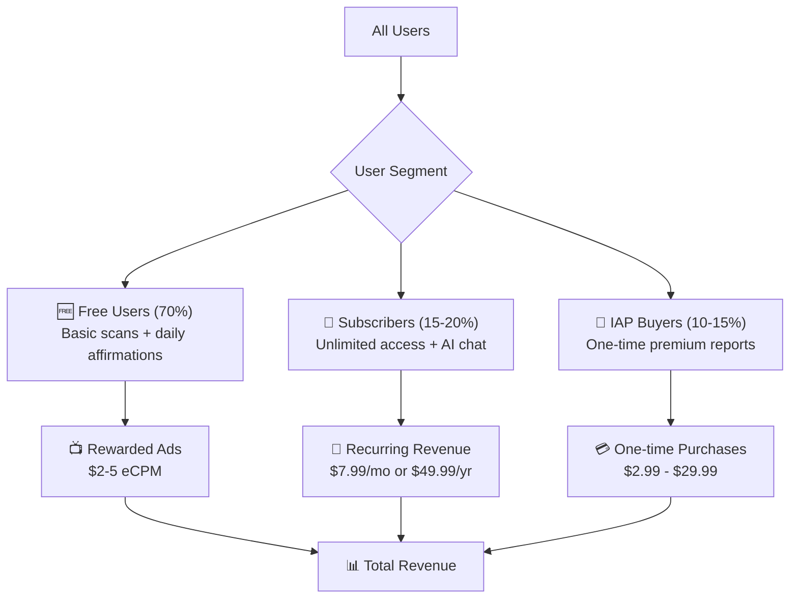
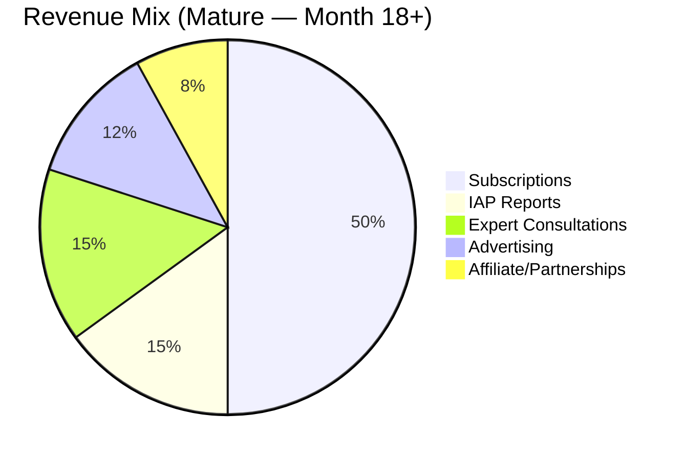

# 💰 Monetization Strategy — PalmVerse

---

## Monetization Philosophy

> **"Give magic for free, sell depth for money."**

The free experience must feel complete and magical — users should never feel like the free version is "broken." Premium unlocks **depth, frequency, and personalization**, not basic functionality.

---

## 1. Revenue Model: Hybrid Freemium

---

## 2. Free Tier — "The Hook"

What free users get — enough to experience the magic and form a daily habit:

| Feature | Free Allowance |
|:---|:---|
| **Palm Scans** | 1 per day |
| **Line Detection** | All 5 major lines detected and visualized |
| **Basic Reading** | ~200-word personality summary per scan |
| **Hand Type Classification** | Full access |
| **Daily Affirmation** | 1 personalized affirmation/day |
| **Daily Lucky Number/Color** | Full access |
| **Fortune Card Sharing** | Full access (with PalmVerse watermark) |
| **Reading History** | Last 7 days only |
| **AI Chat** | 3 messages/day |
| **Ads** | Banner ads + optional rewarded video for bonus scan |

> [!TIP]
> **The free tier is intentionally generous** on the scan visualization (the "wow" moment) and stingy on depth (the detailed interpretation). This ensures every user has a share-worthy first experience.

---

## 3. Premium Subscription — "PalmVerse Pro"

### 3.1 Pricing Tiers

| Plan | Price | Effective Monthly | Savings | Target Segment |
|:---|:---|:---|:---|:---|
| **Weekly** | $2.99/week | $12.96/mo | — | Impulse trial users |
| **Monthly** | $7.99/month | $7.99/mo | 38% vs. weekly | Regular users |
| **Annual** | $49.99/year | $4.17/mo | 68% vs. weekly | Committed users |
| **Lifetime** | $99.99 (one-time) | — | — | Power users (limited offer) |

### 3.2 Regional Pricing

| Region | Monthly | Annual | Rationale |
|:---|:---|:---|:---|
| **United States** | $7.99 | $49.99 | Premium market pricing |
| **United Kingdom** | £6.49 | £39.99 | Slightly below US parity |
| **India** | ₹149 (~$1.79) | ₹999 (~$11.99) | Localized for purchasing power |
| **Brazil** | R$24.99 (~$4.50) | R$149.99 (~$27) | Mid-tier emerging market |
| **Southeast Asia** | $3.99 | $24.99 | Adjusted for regional market |

### 3.3 Premium Features

| Feature | Free | Pro |
|:---|:---|:---|
| **Daily Scans** | 1 | Unlimited |
| **Reading Depth** | 200-word summary | Full 2000-word report per category |
| **AI Chat (PalmGuide)** | 3 messages/day | Unlimited |
| **Reading Categories** | Personality only | All 7 categories (Career, Love, Health, Wealth, Life Path, Compatibility, Personality) |
| **Multi-tradition Toggle** | ❌ | ✅ Vedic, Western, Chinese |
| **Palm Evolution Tracker** | ❌ | ✅ Full timeline + comparison |
| **Before/After Analysis** | ❌ | ✅ |
| **Reading History** | 7 days | Unlimited |
| **Fortune Cards** | With watermark | Without watermark + premium designs |
| **Ads** | Banner + interstitial | Ad-free |
| **Exclusive Content** | ❌ | Monthly deep-dive report, seasonal events |
| **Priority Support** | ❌ | ✅ |

### 3.4 Paywall Strategy

#### When to Show the Paywall

| Trigger | Type | Conversion Rate |
|:---|:---|:---|
| **After first scan results** | "Soft" — show premium features as locked sections in the report | ~3% |
| **After 3rd AI chat message** | "Hard" — chat limit reached, subscribe to continue | ~8% |
| **After tapping a premium report category** | "Contextual" — show preview with blurred content | ~6% |
| **After 7-day streak** | "Celebratory" — "You've been consistent! Unlock Pro at 40% off" | ~5% |
| **After compatibility match attempt** | "Social" — "See your full compatibility — subscribe now" | ~7% |

#### Dynamic Paywall (Phase 3)

Use ML to optimize paywall timing and pricing per user:

| Signal | Action |
|:---|:---|
| High engagement (3+ sessions in first 2 days) | Show annual plan prominently (high intent user) |
| Low engagement (1 session, no return) | Trigger re-engagement email with 7-day free trial |
| Social-heavy user (shared 2+ cards) | Lead with compatibility premium offer |
| Scan-heavy user (daily scans) | Lead with unlimited scans + evolution tracker |

---

## 4. In-App Purchases (IAP) — À La Carte

For users who don't want a subscription but will pay for specific, high-value outcomes.

### 4.1 Premium Reports

| Report | Price | Description |
|:---|:---|:---|
| **Deep Dive: Career & Purpose** | $4.99 | 3000-word analysis of career lines, leadership indicators, entrepreneurial traits |
| **Deep Dive: Love & Compatibility** | $4.99 | Heart line deep analysis + relationship patterns + partner compatibility framework |
| **Deep Dive: Health Awareness** | $3.99 | Health line patterns + wellness indicators + actionable lifestyle suggestions |
| **Deep Dive: Wealth & Fortune** | $4.99 | Money lines, financial decision-making patterns, abundance indicators |
| **Complete Life Report** | $9.99 | All categories combined into one comprehensive 10,000-word report |
| **Annual Palm Report** | $7.99 | Year-over-year comparison with growth analysis |
| **Bundle: All Deep Dives** | $14.99 | All 4 individual deep dives at 25% discount |

### 4.2 Expert Consultations

| Session Type | Price | Description |
|:---|:---|:---|
| **Chat Consultation (Async)** | $9.99 | Text-based consultation with certified palmist, 24hr response |
| **Video Call — 15 min** | $14.99 | Live video reading with expert |
| **Video Call — 30 min** | $24.99 | Extended live video reading |
| **Video Call — 60 min** | $44.99 | Comprehensive in-depth session |

### 4.3 Credits & Consumables

| Item | Price | Use |
|:---|:---|:---|
| **5 Bonus Scans** | $1.99 | Extra scans beyond daily free limit |
| **PalmGuide Chat Pack (50 messages)** | $2.99 | Extra AI chat messages beyond free limit |
| **Premium Fortune Card Designs (10 pack)** | $1.99 | Exclusive, animated shareable card templates |

---

## 5. Advertising Revenue

For the ~70% of users who remain on the free tier.

### 5.1 Ad Formats

| Format | Placement | eCPM Target | User Experience |
|:---|:---|:---|:---|
| **Rewarded Video** | "Watch ad to unlock bonus scan" or "Watch ad to reveal one premium insight" | $15–$25 | Positive — user chooses to engage |
| **Native Banner** | Bottom of reading results page, home feed | $2–$5 | Low friction, non-intrusive |
| **Interstitial** | Between reading categories (max 1 per session) | $8–$15 | Moderate — capped frequency |

### 5.2 Ad Rules

> [!WARNING]
> **Never show ads during the scan flow or while results are being revealed.** This is the magical moment and must remain pristine. Ads should feel like they exist alongside the experience, not interrupting it.

| Rule | Detail |
|:---|:---|
| **No ads during scan** | Camera → capture → line tracing → reveal is ad-free |
| **Max 2 ads per session** | Prevents ad fatigue |
| **No ads in first session** | First-time users see zero ads |
| **Rewarded ads are always optional** | Never forced |
| **Premium users see zero ads** | Core subscription value prop |

---

## 6. Revenue Projections

### 6.1 Assumptions

| Metric | Conservative | Moderate | Aggressive |
|:---|:---|:---|:---|
| Year 1 Downloads | 300K | 700K | 1.5M |
| MAU (Month 12) | 50K | 120K | 300K |
| Free → Pro Conversion | 4% | 6% | 9% |
| ARPU (blended) | $1.50 | $3.00 | $5.00 |
| Avg. Subscription Price | $5.50/mo | $5.50/mo | $5.50/mo |

### 6.2 Monthly Revenue Projections (Month 12)

| Revenue Stream | Conservative | Moderate | Aggressive |
|:---|:---|:---|:---|
| **Subscriptions** | $11,000 | $39,600 | $148,500 |
| **IAP (Reports)** | $3,000 | $8,400 | $22,500 |
| **IAP (Expert Consults)** | $1,500 | $6,000 | $18,000 |
| **Advertising** | $4,200 | $12,600 | $37,800 |
| **Total MRR (Month 12)** | **$19,700** | **$66,600** | **$226,800** |
| **Annualized Run Rate** | **$236K** | **$799K** | **$2.7M** |

### 6.3 Revenue Mix Target (Mature State)

---

## 7. Pricing Psychology & Tactics

| Tactic | Implementation |
|:---|:---|
| **Anchoring** | Show weekly price ($2.99/week = $155/yr) next to annual ($49.99/yr) — annual feels like a steal |
| **Free Trial** | 3-day free trial for annual plan to reduce friction |
| **Loss Aversion** | "Your 7-day streak is at risk! Subscribe to never lose progress" |
| **Social Proof** | "Join 50,000+ seekers who upgraded to Pro" |
| **Scarcity** | "Lifetime plan available for first 1,000 users only" |
| **Decoy Pricing** | Weekly plan exists primarily to make monthly look reasonable |
| **Celebration Discounts** | 30% off on user's birthday, New Year, app anniversary |

---

## 8. Key Financial Metrics to Track

| Metric | Definition | Target |
|:---|:---|:---|
| **LTV (Lifetime Value)** | Total revenue per user over their lifetime | >$8.00 |
| **CAC (Customer Acquisition Cost)** | Total spend to acquire one user | <$2.00 |
| **LTV:CAC Ratio** | Return on acquisition investment | >4:1 |
| **ARPU** | Average revenue per user (all users) | $2.50–$4.00 |
| **ARPPU** | Average revenue per paying user | $6.00–$10.00 |
| **Churn Rate** | Monthly subscriber churn | <8% |
| **Payback Period** | Time to recover CAC | <60 days |
| **Trial → Paid Conversion** | Free trial users who convert to paid | >40% |
