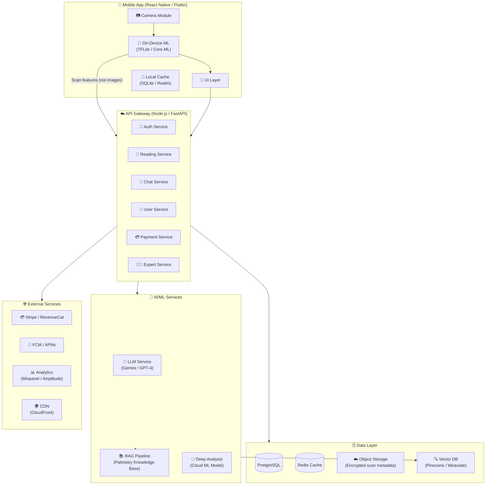
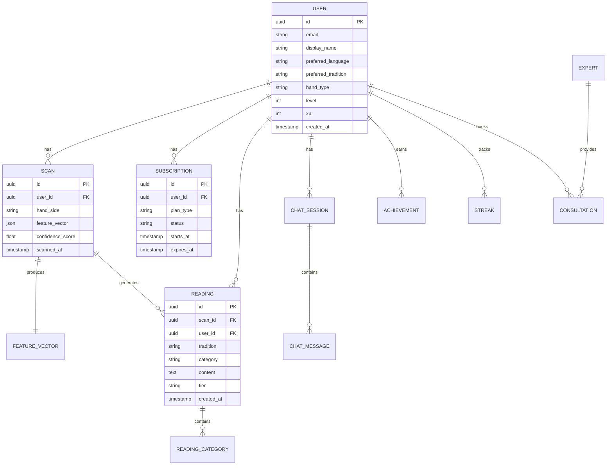
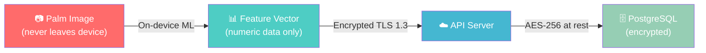

# ⚙️ Technical Architecture — PalmVerse

---

## Architecture Philosophy

> **"On-device for speed and privacy, cloud for intelligence and depth."**

The palm scanning and basic line detection runs entirely on-device for instant feedback and privacy. Detailed AI readings, chat, and personalization leverage cloud services with a privacy-first data pipeline.

---

## 1. System Architecture Overview



---

## 2. Tech Stack Decision Matrix

### 2.1 Mobile App

| Option | Pros | Cons | Recommendation |
|:---|:---|:---|:---|
| **React Native** | Large community, code reuse, Expo ecosystem | Performance concerns for heavy CV, bridge overhead | 🟡 Good |
| **Flutter** | Superior performance, beautiful UI, growing community | Smaller talent pool, Dart learning curve | 🟢 Better |
| **Native (Swift + Kotlin)** | Best performance, full platform API access | 2x development effort, 2x maintenance | 🔴 Overkill for MVP |
| **Web App (PWA)** | Zero install friction, universal | Limited camera API, no push notifications (iOS), no app store presence | 🟡 Good for Phase 4 companion |

> [!IMPORTANT]
> **Recommendation: Start with a Web App (Next.js PWA) for MVP, plan native apps for Phase 2.**
> 
> For a lean MVP launch, a responsive web app lets us validate the concept with zero app store friction. We can use the Web Camera API + TensorFlow.js for on-device scanning. Native apps (Flutter) follow once product-market fit is confirmed.

### 2.2 Backend

| Component | Technology | Rationale |
|:---|:---|:---|
| **API Framework** | **Next.js API Routes** (MVP) → **FastAPI** (scale) | Next.js for unified codebase in MVP; FastAPI for ML-heavy workloads later |
| **Database** | **PostgreSQL** (via Supabase or Neon) | Relational data model, robust, excellent for user profiles and reading history |
| **Cache** | **Redis** (Upstash) | Session caching, rate limiting, feature flags |
| **Object Storage** | **Cloudflare R2** or **AWS S3** | Encrypted scan metadata storage (never raw images) |
| **Authentication** | **Firebase Auth** or **Supabase Auth** | Social logins, magic links, phone auth for India market |
| **Payments** | **RevenueCat** (native) + **Stripe** (web) | Industry standard for subscription management |

### 2.3 AI/ML Pipeline

| Component | Technology | Rationale |
|:---|:---|:---|
| **Hand Detection** | **MediaPipe Hands** (via TensorFlow.js) | Google's production-ready hand landmark model, runs in-browser |
| **Line Extraction** | **OpenCV.js** + **Custom CNN** | Edge detection, contour analysis for major palm lines |
| **Reading Generation** | **Gemini 2.0 Flash** (via Firebase AI Logic) | Fast, cost-effective LLM for generating personalized readings |
| **RAG Knowledge Base** | **Pinecone** or **Weaviate** | Vector store for 3-tradition palmistry knowledge retrieval |
| **Chat Memory** | **Redis** + **PostgreSQL** | Short-term context in Redis, long-term history in PostgreSQL |

---

## 3. AI/ML Pipeline — Detailed

### 3.1 Palm Scanning Pipeline

```mermaid
flowchart LR
    subgraph OnDevice["📱 On-Device (< 2 seconds)"]
        A["📷 Camera Frame"] --> B["🖐️ MediaPipe\nHand Landmarks\n(21 points)"]
        B --> C["✂️ ROI Extraction\n(Palm region crop)"]
        C --> D["🔍 Pre-processing\n(Grayscale, contrast,\nedge enhancement)"]
        D --> E["📐 Line Detection\n(OpenCV contours +\nCNN classifier)"]
        E --> F["📊 Feature Vector\n(line lengths, curves,\nbreaks, forks, mounts)"]
    end

    subgraph Cloud["☁️ Cloud (< 3 seconds)"]
        F -->|"Feature vector only\n(no image sent)"| G["📚 RAG Query\n(Palmistry KB)"]
        G --> H["🧠 LLM Prompt\nConstruction"]
        H --> I["✨ Gemini 2.0\nReading Generation"]
        I --> J["📄 Formatted\nReading Result"]
    end
```



### 3.2 Feature Vector Schema

The feature vector extracted from palm analysis — **this is what gets sent to cloud, never the image**.

```json
{
  "scan_id": "uuid",
  "timestamp": "2026-08-15T10:30:00Z",
  "hand": "right",
  "hand_shape": {
    "type": "fire",
    "palm_ratio": 0.82,
    "finger_length_ratio": 0.65
  },
  "lines": {
    "heart": {
      "present": true,
      "start_point": [0.23, 0.45],
      "end_point": [0.78, 0.52],
      "length": 0.71,
      "depth": "deep",
      "curvature": "moderate_upward",
      "breaks": [],
      "forks": [{"position": 0.85, "type": "double"}],
      "branches_up": 2,
      "branches_down": 0,
      "ends_at": "jupiter_mount"
    },
    "head": { "..." : "similar structure" },
    "life": { "..." : "similar structure" },
    "fate": { "..." : "similar structure" },
    "sun": { "..." : "similar structure" }
  },
  "mounts": {
    "jupiter": {"prominence": "high"},
    "saturn": {"prominence": "medium"},
    "apollo": {"prominence": "high"},
    "mercury": {"prominence": "low"},
    "venus": {"prominence": "medium"},
    "moon": {"prominence": "high"},
    "mars_positive": {"prominence": "medium"},
    "mars_negative": {"prominence": "low"}
  },
  "special_marks": ["star_on_apollo", "cross_on_jupiter"],
  "finger_analysis": {
    "index_to_ring_ratio": 0.96,
    "thumb_flexibility": "moderate"
  }
}
```

### 3.3 RAG Knowledge Base Structure

```
palmistry_knowledge_base/
├── vedic/
│   ├── heart_line_interpretations.md
│   ├── head_line_interpretations.md
│   ├── life_line_interpretations.md
│   ├── fate_line_interpretations.md
│   ├── mount_interpretations.md
│   ├── hand_types.md
│   ├── special_marks.md
│   └── combinations_and_yogas.md
├── western/
│   ├── heart_line_interpretations.md
│   ├── head_line_interpretations.md
│   ├── ... (same structure)
│   └── elemental_hand_types.md
├── chinese/
│   ├── heart_line_interpretations.md
│   ├── ... (same structure)
│   └── five_element_hand_analysis.md
└── cross_tradition/
    ├── personality_composites.md
    ├── career_indicators.md
    ├── relationship_patterns.md
    ├── health_markers.md
    └── wealth_indicators.md
```

### 3.4 LLM Prompt Architecture

```
System Prompt:
"You are PalmGuide, an expert AI palmist trained in Vedic, Western, 
and Chinese palmistry traditions. You provide insightful, warm, and 
personalized readings based on palm feature analysis data. You never 
make medical diagnoses or financial advice. You present insights as 
reflections for self-discovery, not predictions. You are empathetic, 
wise, and gently confident."

Context Injection (per request):
1. User's palm feature vector
2. Retrieved RAG passages (top 5 most relevant)
3. User's selected tradition (Vedic/Western/Chinese/All)
4. User's reading history summary (if returning user)
5. Specific question (if in chat mode)

Guardrails:
- Never make medical claims
- Never make specific financial predictions
- Always include "for entertainment and self-reflection" context
- Respond in user's preferred language
- Match depth to subscription tier (free=concise, premium=detailed)
```

---

## 4. Data Model

### 4.1 Core Entities



---

## 5. Privacy & Security Architecture

### 5.1 Core Privacy Principles

| Principle | Implementation |
|:---|:---|
| **No image storage** | Raw palm images are processed on-device and immediately discarded. Only feature vectors are stored |
| **Feature vector encryption** | All feature vectors encrypted at rest (AES-256) and in transit (TLS 1.3) |
| **Data minimization** | Only collect what's needed for the reading; no metadata harvesting |
| **User data ownership** | Full GDPR/CCPA compliance: export, delete, portability |
| **On-device ML** | Hand detection and line extraction run entirely on the user's device |
| **Transparent privacy policy** | Clear, human-readable privacy page explaining exactly what data flows where |

### 5.2 Data Flow — Privacy Perspective



> [!CAUTION]
> **The raw palm image NEVER leaves the user's device and is NEVER transmitted to our servers.** This is a non-negotiable architectural decision and a key trust differentiator.

---

## 6. Infrastructure & DevOps

### 6.1 MVP Infrastructure (Web App)

| Component | Service | Est. Monthly Cost |
|:---|:---|:---|
| **Hosting** | Vercel (Next.js) | $20/mo (Pro) |
| **Database** | Supabase (PostgreSQL) | $25/mo (Pro) |
| **Auth** | Supabase Auth | Included |
| **Redis** | Upstash | $10/mo |
| **AI/LLM** | Google AI (Gemini 2.0 Flash) | ~$50–200/mo (usage-based) |
| **Vector DB** | Pinecone (Starter) | $0–70/mo |
| **Object Storage** | Cloudflare R2 | ~$5/mo |
| **Analytics** | Mixpanel (Free tier) | $0 |
| **CDN** | Vercel Edge | Included |
| **Total** | | **~$110–330/mo** |

### 6.2 Scale Infrastructure (Month 6+)

| Component | Service | Est. Monthly Cost |
|:---|:---|:---|
| **Hosting** | GCP Cloud Run (auto-scaling) | $200–500/mo |
| **Database** | Cloud SQL (PostgreSQL) | $100–300/mo |
| **Redis** | Cloud Memorystore | $50–100/mo |
| **AI/LLM** | Vertex AI (Gemini) | $500–2000/mo |
| **Vector DB** | Pinecone (Standard) | $70–200/mo |
| **Storage** | Cloud Storage | $20–50/mo |
| **CDN** | Cloud CDN | $50–100/mo |
| **Monitoring** | Cloud Monitoring + Sentry | $50–100/mo |
| **Total** | | **~$1,040–3,350/mo** |

---

## 7. Performance Targets

| Metric | Target |
|:---|:---|
| **Hand detection latency** | < 100ms (on-device) |
| **Line extraction** | < 500ms (on-device) |
| **Full scan-to-results** | < 5 seconds (including cloud AI) |
| **AI chat response** | < 3 seconds |
| **App cold start** | < 2 seconds |
| **API response (p99)** | < 500ms |
| **Uptime** | 99.9% |
| **Lighthouse Score** | > 90 (Performance, Accessibility) |

---

## 8. Development Phases — Technical

### Phase 1: Web MVP (Weeks 1–8)

```
Week 1-2: Project setup, design system, landing page
Week 3-4: Camera integration, MediaPipe hand detection
Week 5-6: Line extraction, feature vector generation, basic UI
Week 7:   Gemini integration, RAG pipeline, reading generation
Week 8:   Auth, payments, deployment, testing
```

### Phase 2: Enhancement (Weeks 9–16)

```
Week 9-10:  AI Chat (PalmGuide) with conversation memory
Week 11-12: Multi-tradition support, reading categories
Week 13-14: Gamification (streaks, badges, daily affirmations)
Week 15-16: Social sharing, compatibility, push notifications
```

### Phase 3: Native Apps (Weeks 17–24)

```
Week 17-20: Flutter app development (iOS + Android)
Week 21-22: Native ML integration (TFLite, Core ML)
Week 23-24: App store submission, testing, launch
```
